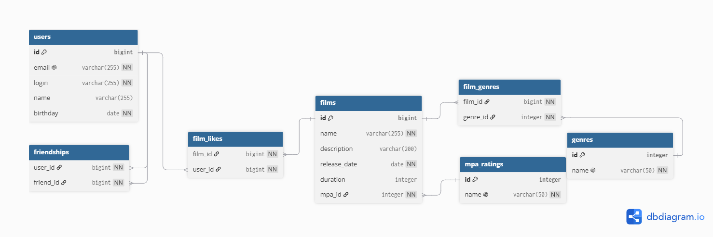

# java-filmorate
Доброго дня, мой ревьюер по ER-диаграммке. Хорошей проверки!

## Прикрепляю диаграмму:


### Пояснение к схеме данных
* **Сущности:** `users` (пользователи) и `films` (фильмы).
* **Справочники:** `mpa_ratings` (рейтинги MPA) и `genres` (жанры). Каждый фильм ссылается на один MPA (`Many-to-One`) через внешний ключ `mpa_id`, но может иметь несколько жанров через связующую таблицу `film_genres` (`Many-to-Many`).
* **Связи:**
    * `film_likes` — фиксирует лайки пользователей к фильмам. Композитный ключ `(film_id, user_id)` исключает дублирование лайков от одного человека.
    * `friendships` — рефлексивная связь «Многие-ко-Многим» между пользователями для реализации подписок. Поля `user_id` (отправитель) и `friend_id` (получатель) связывают пользователей из таблицы `users`.

---

## Примеры SQL-запросов для основных операций

### 1. Операции с фильмами (Films)

* **Получение всех фильмов (включая название их рейтинга MPA):**
```sql
SELECT f.*, m.name AS mpa_name
FROM films f
LEFT JOIN mpa_ratings m ON f.mpa_id = m.id;
```

* **Получение ТОП-N самых популярных фильмов по количеству лайков:**
```sql
SELECT f.*, COUNT(fl.user_id) AS rate
FROM films f
LEFT JOIN film_likes fl ON f.id = fl.film_id
GROUP BY f.id
ORDER BY rate DESC
LIMIT 10; -- 10 = N
```

* **Получение всех жанров для конкретного фильма (например, с id = 1):**
```sql
SELECT g.*
FROM genres g
JOIN film_genres fg ON g.id = fg.genre_id
WHERE fg.film_id = 1;
```

### 2. Операции с пользователями (Users) и Дружба

Логика дружбы построена на концепции подписок (follows). Если Пользователь А добавляет Пользователя Б, в таблице появляется одна строка — это "односторонняя дружба". Если Пользователь Б добавляет Пользователя А в ответ, в таблице появляется зеркальная строка — дружба становится "двухсторонней" (подтвержденной).

* **Проверка: является ли дружба двухсторонней (взаимной) для id = 1 и id = 2:**
```sql
SELECT EXISTS (
    SELECT 1
    FROM friendships AS f1
    JOIN friendships AS f2 ON f2.user_id = f1.friend_id AND f2.friend_id = f1.user_id
    WHERE f1.user_id = 1 AND f1.friend_id = 2
      AND f2.user_id = 2 AND f2.friend_id = 1
);
```

* **Получение списка всех друзей пользователя (id = 1), включая односторонние подписки:**
  *(По ТЗ: "независимо от подтверждения, у первого пользователя в списке друзей УЖЕ будет находиться второй")*
```sql
SELECT u.*
FROM users u
JOIN friendships f ON u.id = f.friend_id
WHERE f.user_id = 1;
```

* **Получение списка общих друзей между двумя пользователями (id = 1 и id = 2):**
```sql
SELECT friend_id FROM friendships WHERE user_id = 1
INTERSECT
SELECT friend_id FROM friendships WHERE user_id = 2;
```

* **Добавление в друзья / Подписка (Пользователь 1 добавляет Пользователя 2):**
```sql
INSERT INTO friendships (user_id, friend_id) VALUES (1, 2);
```

* **Удаление из друзей / Отписка (Пользователь 1 удаляет Пользователя 2):**
  *(При этом, если Пользователь 2 оставлял Пользователя 1 в друзьях, его строка `(2, 1)` останется нетронутой)*
```sql
DELETE FROM friendships WHERE user_id = 1 AND friend_id = 2;
```

### 3. Взаимодействия (Likes)

* **Добавление лайка фильму:**
```sql
INSERT INTO film_likes (film_id, user_id) 
VALUES (1, 5); -- Пользователь 5 лайкнул фильм 1
```

* **Удаление лайка с фильма:**
```sql
DELETE FROM film_likes 
WHERE film_id = 1 AND user_id = 5;
```
